# HHA 504 Week 4: MySQL on Azure and GCP Cloud Platforms

## GCP setup instructions

1. After logging into console.cloud.google, select the student resource group
2. Select SQL > MySQL from the sidebar menu
3. Create instance and follow the provided instructions to ensure the lowest monthly payment possible:
        
        
        DB-standard-1 (vCPU 1, RAM 3.75gb)
        10gb storage
        No backups [$9.37 month]

4. Under authorized networks, add the IP address of 0.0.0.0/0 

## Azure setup instructions

1. Sign into portal.azure.com 
2. Navigate to applications > Azure Database for MySQL flexible servers 
3. Ensure student resource group is chosen as the subscription for the application
4. Create instance and follow the provided instructions to ensure the lowest monthly payment possible:

    
        Azure Database for MySQL
        Deployment option: Flexible,
        Tier: Burstable
        Compute: B1S [$6.21 p/month] or B1MS [$12.41 p/month]

5. Under networking, ensure IP address 0.0.0.0 is included and public access is checked off

### <b> GCP Setup </b> 

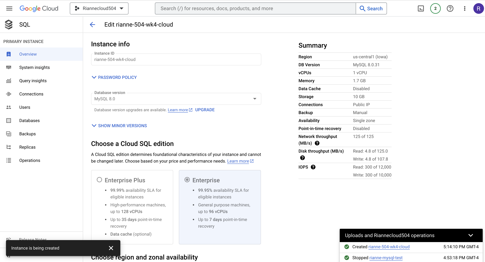
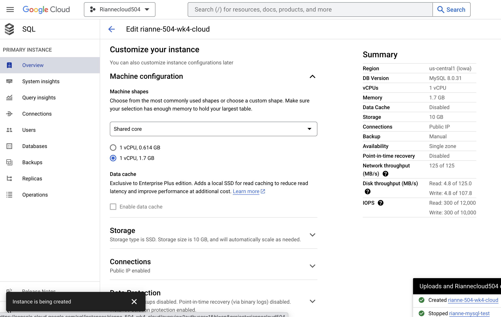
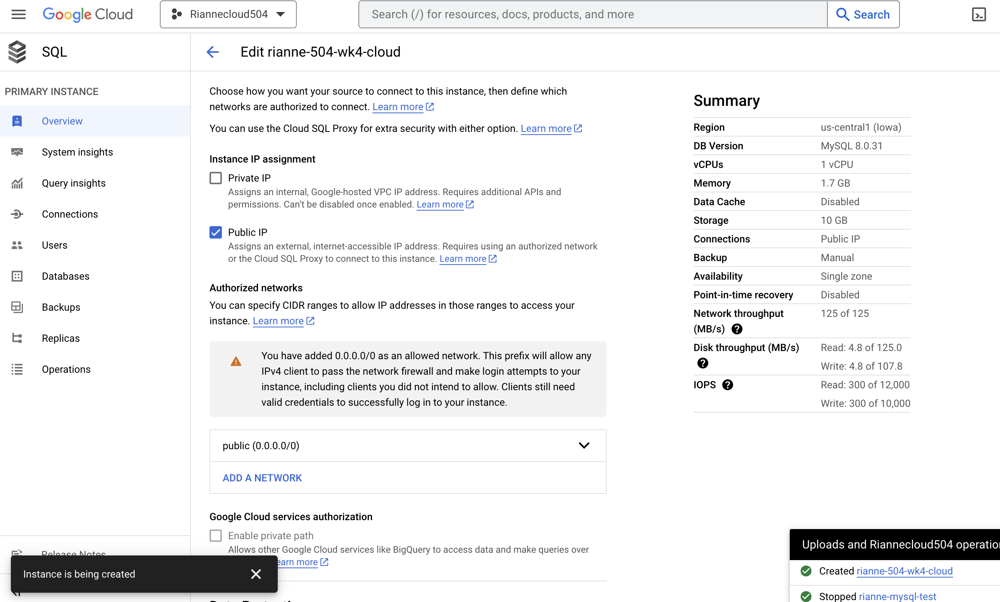

### <b> Azure Setup </b> 

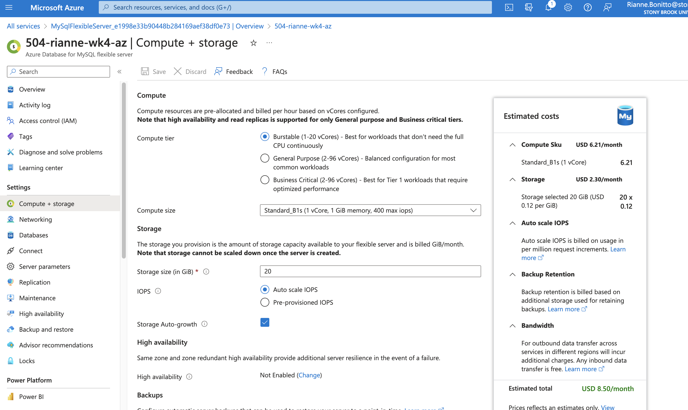
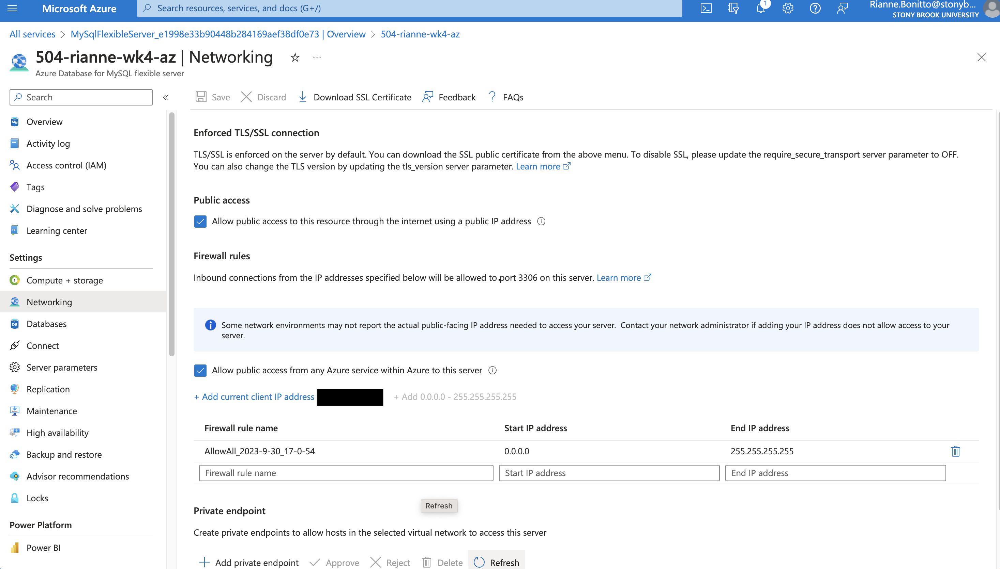

## MySQL setup

1. Open MySQL and create new connections for GCP and Azure respectively
2. Enter the hostname, username and passwords for GCP and Azure
3. Test connections to ensure the link

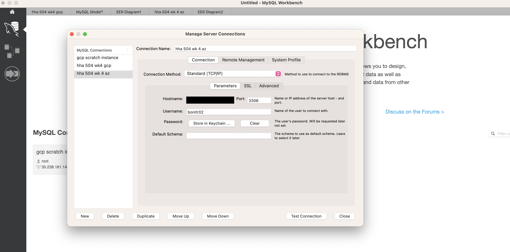
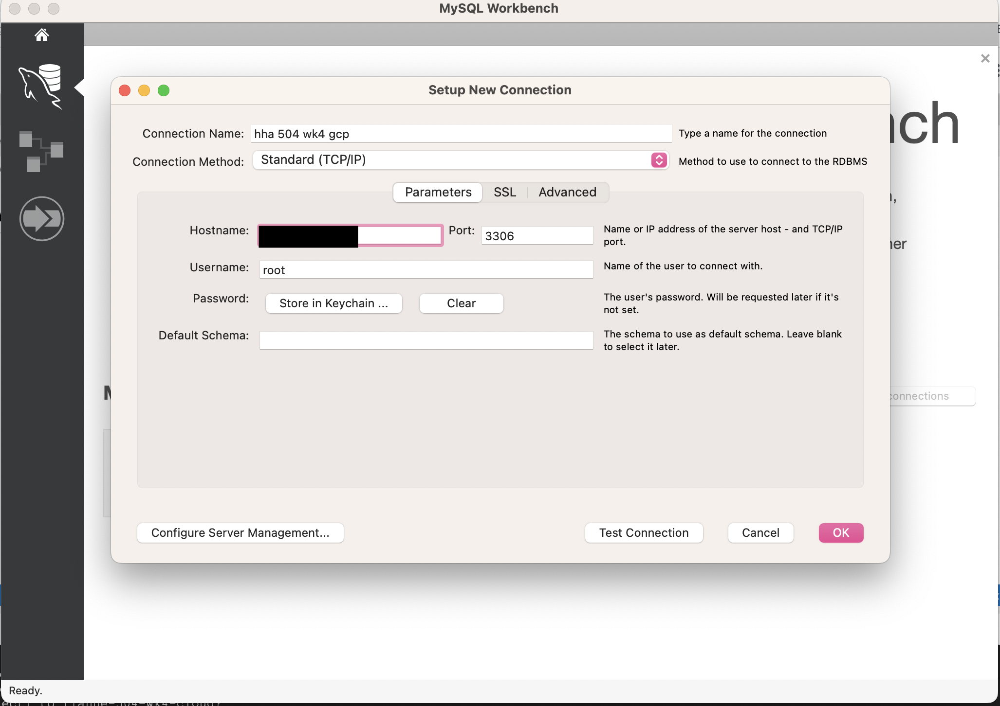

## MySQL document: create.sql
Refer to create.sql for MySQL code

## MySQL Commands and ERD

The commands and ERD are the same for both GCP and Azure databases

<b> Commands </b>

1. Created a new query file
2. Use the Show databases; command to view available databases
3. Use the create database; command to name a new database
4. Use the use; command to work within the new database
5. Use the show tables; command to show available tables within the chosen database
5. Use the create table command to create multiple tables with columns 

<b> ERD </b>

1. Database > Reverse Engineer
2. Follow the prompts and select the database
3. Edit the relationships were appropriate on the diagram to show 1:1 vs 1:Many

### <b> GCP Commands </b> 
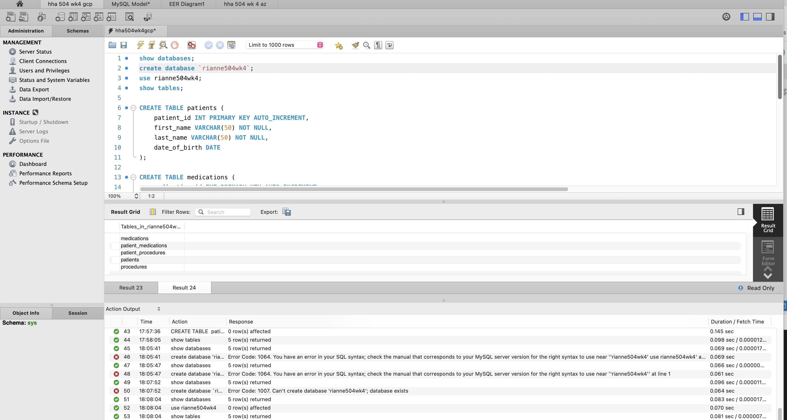
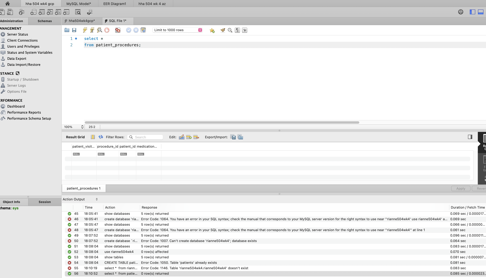

### <b> GCP ERD </b> 

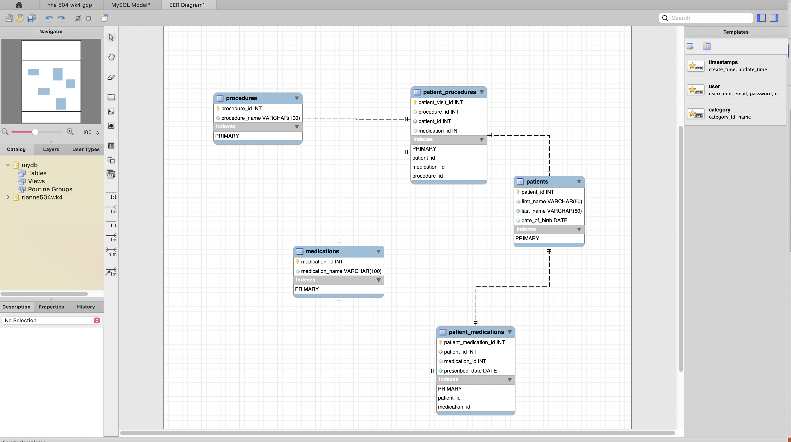

### <b> Azure Commands </b>

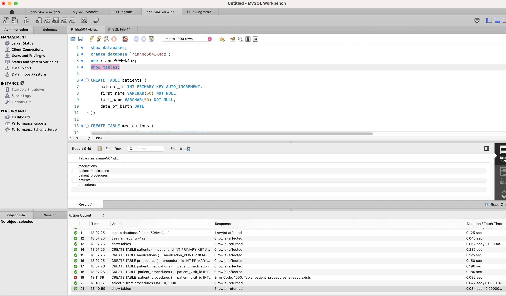
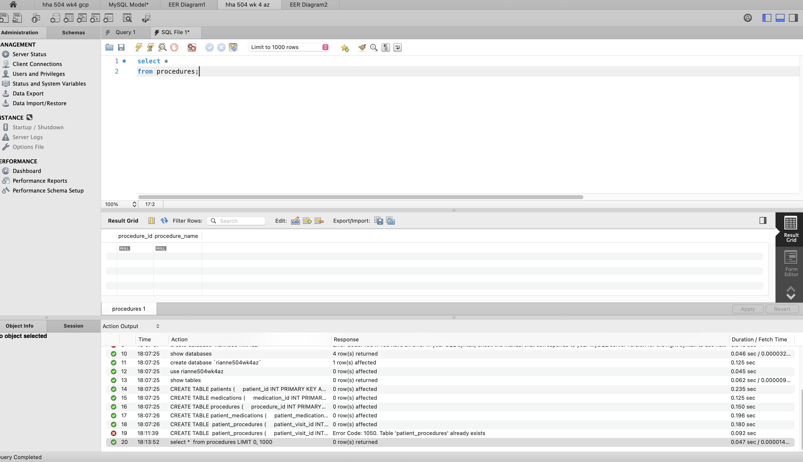

### <b> Azure ERD </b>

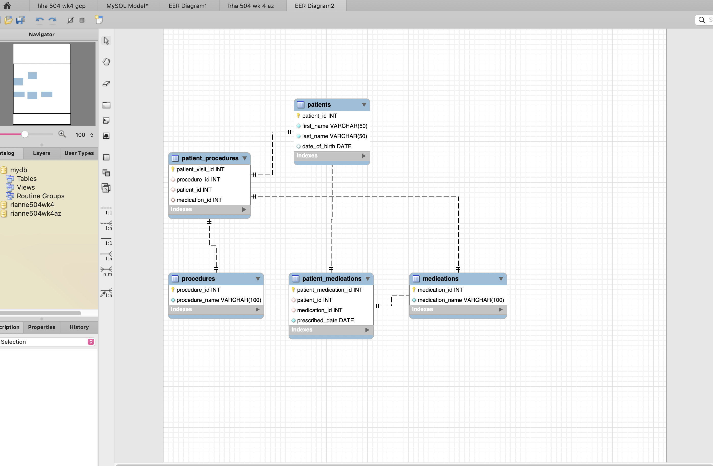

## Troublshooting / Comments

- I experienced issues with loading the dotenv module in the cloud shell so did not perform the optional portion of the assignment

- No issues with gcp, azure or mysql setups. All were completed without difficulty.
